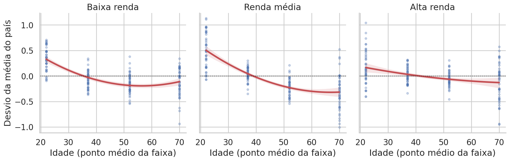
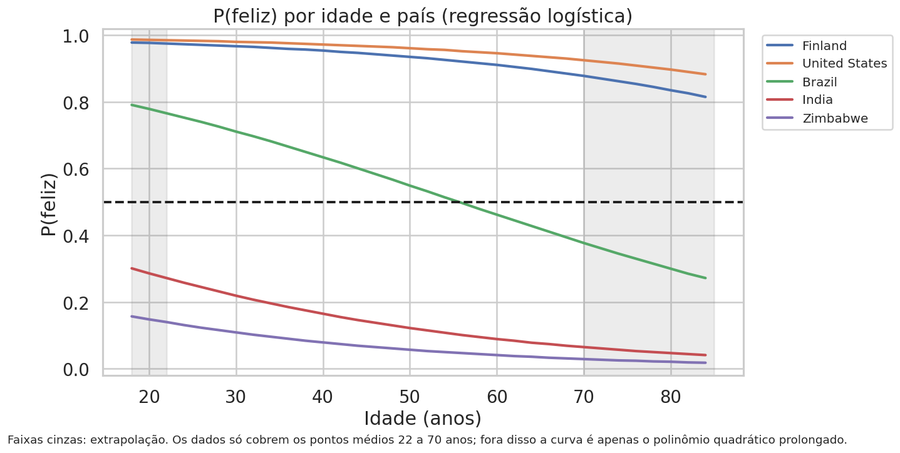

# Felicidade por idade e por país

LAB de Inteligência Artificial (Ciência da Computação, PUC-SP): testamos se a satisfação com a vida segue uma **curva em U** ao longo da idade e quanto disso depende da riqueza do país, usando regressão linear e regressão logística com scikit-learn.

**Dupla:**

| Nome | RA | GitHub |
| --- | --- | --- |
| Rubens Rodrigues Luiz Sexto de Luiggi Maranesi | RA00331129 | [@Rubziguin](https://github.com/Rubziguin) |
| Pedro Gabriel Takenobu Serafim | RA00340890 | [@pedrogts](https://github.com/pedrogts) |

## Como executar

- Python 3.10+ (testado no Google Colab).
- `pip install -r requirements.txt`
- Abra `lab_felicidade_idade_pais.ipynb` e rode **Kernel → Restart & Run All**. No Colab, envie `lab_helpers.py`, `country_table.csv` e `mylib.py` quando a segunda célula pedir.

`country_table.csv` é uma foto dos indicadores do Banco Mundial baixada em 2026-09-21. Para buscar de novo na API, use `build_country_table(refresh=True)`.

## Principais figuras

## Conclusões

- **Riqueza pesa muito mais que idade.** A idade sozinha explica ≈2% da nota (R² em validação cruzada por país). Com log do PIB per capita, população e área, o R² sobe para ≈0,63. Dobrar o PIB per capita vale ≈+0,6 ponto na escada de 0 a 10; ir de 22 para 70 anos vale ≈−0,5.
- **Dentro dos países, a curva é mais uma queda que se achata do que um U.** Os jovens (<30) ficam ≈0,34 ponto acima da média do próprio país e os 60+ ≈0,19 abaixo. A parábola vira perto dos 63 anos, não nos 40-50 citados pelo WEF. Só os países de renda baixa mostram uma leve subida no final.
- **O padrão não é universal**, como diz o WHR 2024: nos EUA, no Canadá e nos países nórdicos os mais velhos são os mais felizes; na Europa Central e Oriental (Lituânia, Sérvia, Croácia) os jovens são muito mais felizes.
- **Regressão logística** ("feliz" = acima da mediana, 5,65): AUC ≈0,91 em países não vistos (média de 20 sementes), quase tudo vindo do PIB. Com divisão aleatória, o Random Forest chega a ≈0,97 porque "reconhece" países já vistos: é vazamento.

## Limitações

- As linhas são **médias de grupos**, não pessoas (falácia ecológica).
- A idade é o ponto médio de 4 faixas; `60+` = 70 é uma suposição (com 65, o mínimo vai para ≈61,5 anos).
- Um único corte transversal (2021-2023) não separa efeito de **idade** de efeito de **coorte**.
- Taiwan, Venezuela e Iêmen ficaram de fora por falta de dados do Banco Mundial. A área de Kosovo foi completada à mão (10.887 km²).
- O modelo usa o mesmo formato de idade para todos os países (sem interação idade × país).

## Fontes

- Helliwell, J. F., Layard, R., Sachs, J. D., De Neve, J.-E., Aknin, L. B., & Wang, S. (Eds.). (2024). *World Happiness Report 2024*. Dados por faixa etária (média 2021-2023) via **Our World in Data**, [Self-reported life satisfaction by age](https://ourworldindata.org/grapher/cantril-ladder-age-groups) (CC BY), baixado em 2026-09-20.
- **Banco Mundial**, World Development Indicators (API v2): `NY.GDP.PCAP.PP.KD`, `SP.POP.TOTL`, `AG.LND.TOTL.K2`; último valor não faltante de 2019-2023; baixado em 2026-09-21; junção por ISO3.
- **World Happiness Report**, planilha da Figura 2.1 (`WHR26_Data_Figure_2.1.xlsx`), usada só como verificação de sanidade; plano B: `Happiness-Around-the-World-Data.csv` fornecido em aula.
- Leituras: [Gallup: World Happiness Report](https://www.gallup.com/analytics/349487/world-happiness-report.aspx) · [WEF: At what age does happiness peak?](https://www.weforum.org/stories/wellbeing-and-mental-health/at-what-age-does-happiness-peak/) · [WHR 2024: Happiness and age](https://www.worldhappiness.report/ed/2024/happiness-and-age-summary/) · Rauch, J. (2018). *The Happiness Curve*.
